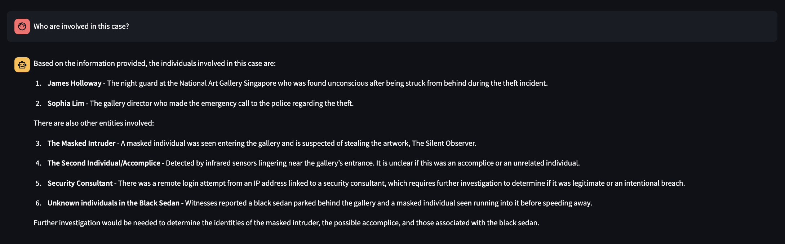

# CrimeWatch

CrimeWatch is a crime analysis and reporting system designed to assist law enforcement and investigators in managing case evidence, generating insights, and improving public safety.



## Features

- **Case Management**: Store and retrieve case details efficiently.
- **Evidence Handling**: Upload, organize, and analyze case evidence.
- **AI-Powered Insights**: Summarize case details and extract key insights.
- **User-Friendly API**: RESTful API for easy integration.


## Tech Stack

- **Backend**: Flask, MongoDB, OpenAI API
- **Frontend**: Streamlit (Python)
- **Database**: MongoDB, Pinecone DB

## Installation

### Prerequisites

Ensure you have the following installed:

- Python 3.12+

### Backend Setup

1. Clone the repository:
   ```sh
   git clone https://github.com/your-username/crimewatch.git
   cd crimewatch/backend
   ```
2. Create a virtual environment and install dependencies:
   ```sh
   python -m venv .venv
   source .venv/bin/activate  # On Windows: .venv\Scripts\activate
   pip install -r requirements.txt
   ```
3. Configure environment variables in a `.env` file:
   ```sh
   MONGO_URI=mongodb://localhost:27017/crimewatch
   FLASK_ENV=development
   OPENAI_API_KEY=your_api_key_here
   ```
4. Run the Flask server:
   ```sh
   flask run --debug
   ```

### Frontend Setup

1. Navigate to the frontend directory:
   ```sh
   cd ../frontend
   ```
2. Install dependencies:
   ```sh
   python -m venv .venv
   source .venv/bin/activate  # On Windows: .venv\Scripts\activate
   pip install -r requirements.txt
   ```
3. Start the Streamlit server:
   ```sh
   streamlit run Dashboard.py
   ```

## API Endpoints

### Case Management

- `GET /cases/{case_id}` - Retrieve case details
- `POST /cases` - Create a new case

### Evidence Management

- `GET /evidence/{evidence_id}` - Retrieve evidence details
- `POST /evidence` - Upload new evidence

### AI Insights

- `POST /chatgpt/` - Generate case summaries and insights

More API docs can be found under `docs/` folder.

## Contributing

1. Fork the repo
2. Create a new branch (`git checkout -b feature-branch`)
3. Commit your changes (`git commit -m 'Add new feature'`)
4. Push to the branch (`git push origin feature-branch`)
5. Open a Pull Request

## License

This project is licensed under the MIT License. See `LICENSE` for details.

## Contact

For any inquiries, please reach out via email or open an issue in the repository.
