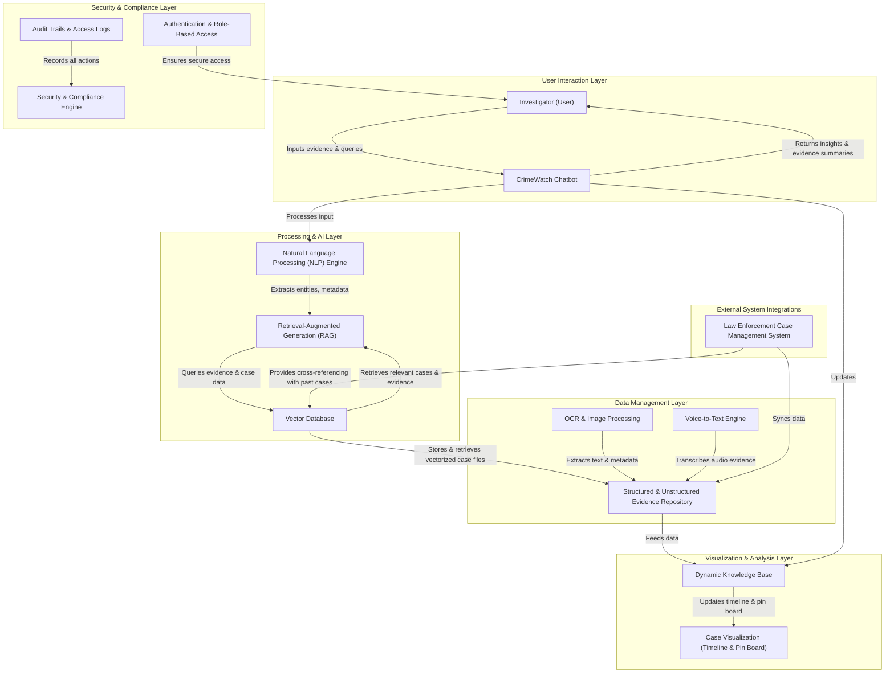

```mermaid
graph TD;

    subgraph User Interaction Layer
        Investigator["Investigator (User)"] -->|Inputs evidence & queries| Chatbot["CrimeWatch Chatbot"]
        Chatbot -->|Returns insights & evidence summaries| Investigator
    end

    subgraph Processing & AI Layer
        Chatbot -->|Processes input| NLP["Natural Language Processing (NLP) Engine"]
        NLP -->|Extracts entities, metadata| RAG["Retrieval-Augmented Generation (RAG)"]
        RAG -->|Queries evidence & case data| VectorDB["Vector Database"]
        VectorDB -->|Retrieves relevant cases & evidence| RAG
    end

    subgraph Data Management Layer
        VectorDB -->|Stores & retrieves vectorized case files| EvidenceRepo["Structured & Unstructured Evidence Repository"]
        OCR["OCR & Image Processing"] -->|Extracts text & metadata| EvidenceRepo
        VoiceToText["Voice-to-Text Engine"] -->|Transcribes audio evidence| EvidenceRepo
    end

    subgraph Visualization & Analysis Layer
        KnowledgeBase["Dynamic Knowledge Base"] -->|Updates timeline & pin board| PinBoard["Case Visualization (Timeline & Pin Board)"]
        EvidenceRepo -->|Feeds data| KnowledgeBase
        Chatbot -->|Updates| KnowledgeBase
    end

    subgraph Security & Compliance Layer
        Auth["Authentication & Role-Based Access"] -->|Ensures secure access| Investigator
        Logs["Audit Trails & Access Logs"] -->|Records all actions| SecurityModule["Security & Compliance Engine"]
    end

    subgraph External System Integrations
        CaseDB["Law Enforcement Case Management System"] -->|Syncs data| EvidenceRepo
        CaseDB -->|Provides cross-referencing with past cases| VectorDB
    end

```
